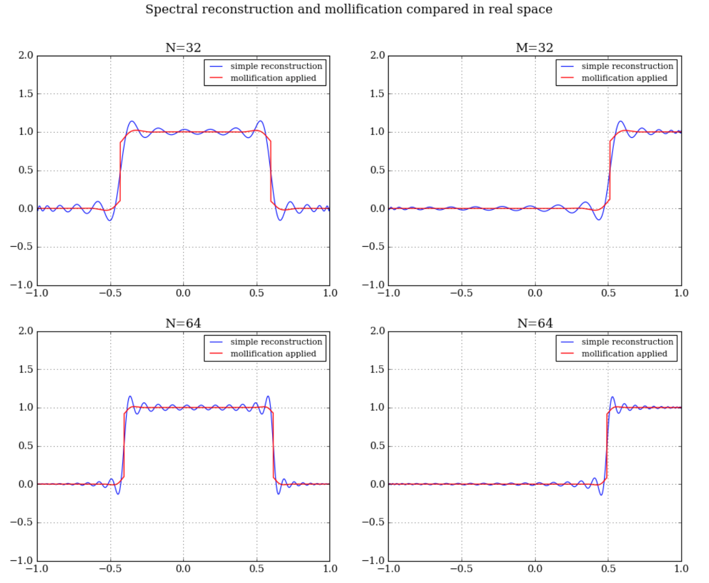
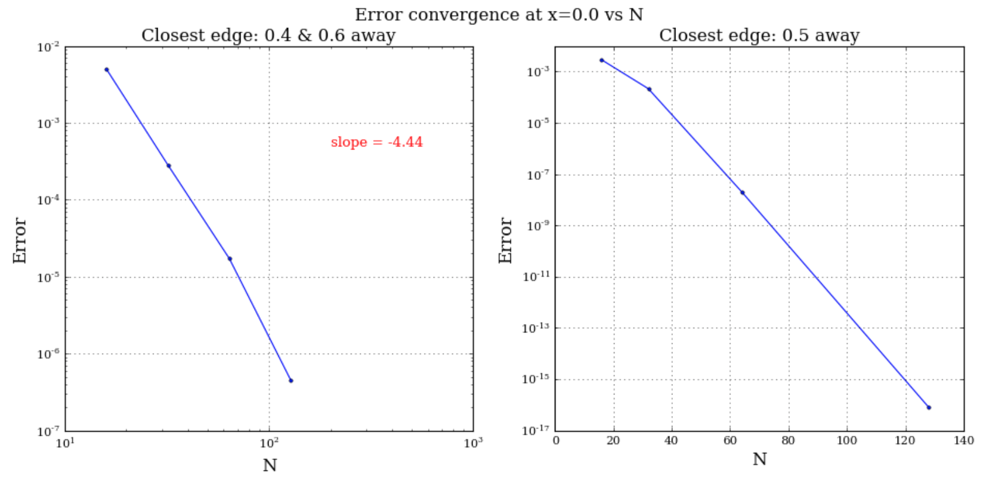

# Mollification attempts summary

All of the efforts presented below are based on a comprehensive paper by Eitan Tadmor - 'Filetrs, mollifiers and computation of the Gibbs phenomenon'.  
The mollifier used througout is the exponentially accurate mollifier in 11.20a, applied in real space, using scipy.integrate.quad. Relevant pieces of code are present in:  
* <b>spectral_tools.py</b> - contains spectral decomposition tools using Chebyshev-Gauss-Lobatto quadrature
* <b>edgedetect.py</b> - contains edge detection tools
* <b>mollification.py</b> - contains all mollification functions reffered to below   

The mollification road has taken many turns, my apologies for terrible time efficiency there - a route of wrong coding-up in discrete convolution led me nowhere, loosing precious hours. 
However, having moved to traditional quadrature integration I believe to have achieved partial success with the mollifiers. The final results can be divided into two sections: <b>Whole domain mollififcation</b> and <b>Piecewise mollification</b>.

# Whole domain mollification

<b>Functions: 
- MollifyQuad 
- MollifyQuadBuffer</b> 

<h3><b>No boundary buffering applied</b></h3>

For the whole domain mollification I straigtforwardly applied Tadmor recipe, performing a traditional convolution of the adaptive mollifying kernel with wiggly top-hat and a step (top-hat making its way out of the domain). The successes and failures are the following:  

<b>Successes:</b> 
 * Reduced Gibbs oscillations, already at N=32. Wiggles are smoothed out significantly, the error falls off quickly away from the discontinuity (I haven't quantified 'quickly', I'm sorry!), reaching ~3x10e-4. 

<b>Failures:</b> 
* Boundary is smoothed out, as if another discontinuity was present there. The top-hat leaving domain frame is significantly distorted.
* The discontinuity is lost in the representation, mollifier smooths out the jump too much. 

In the attempt to fix the first failure I extended the function outside of the [-1,1] domain with a 'buffer zone' by copying a mirror image of the function close to the domain boundary (figure below): 

Results of buffer application along with N-dependence are presented below:

<b>Successes:</b> 
 * Boundary behaviour of 'top-hat' leaving the domain improved, error dropping down to ~6x10e-4 at the boundary. 

<b>Failures:</b> 
* The discontinuity is lost in the representation, mollifier smooths out the jump too much. 

At this stage I was asked to move on, but bothered with this unsatisfactory result I thought of ways to avoid edge smoothing. 

# Piecewise mollification

<b>Function: PiecewiseMollify</b>

As a solution I decided to divide my domain into regions between detected discontinuities and perform 'piecewise mollification' with suitably normalised and 'chopped' mollifiers to avoid incorporating parts of the reconstruction beyond a discontinuity. I'm happy to explain my logic in spoken English, but the reasoning is as follows: 
<i>A discontinuity in a function assumes no information exchange between two pieces of function. These are two separate entities, stitched together in an artificial manner using curly brackets. Therefore the only points that contain relevant and true information about a point to the left of a discontinuity are those physically located to the left of it. Ones to the right are separate entity, therefore shall not be included in the convolution process. Otherwise we're forcing two elements to join against the nature of considered function</i> 

Illustration of the 'chopped' mollifiers for piecewise procedure is presented below (only a few for clarity): 

 

Using this approach results in the following shape of mollified reconstruction for N=32 and N=64:
  
 
------------------------------------------------------------------------------------------------
 

<b>Successes:</b> 
* Previous mollification successes recovered for N=32
* Top-hat crossing the boundary is unaffected by mollification without the need for a buffer
* Discontinuous character of the function is recovered, the function is clearly multivalued at x=edge location 

<b>Failures:</b> 
* quite unpleasant artefacts close to the edge, which decrease with increasing number of N. I believe this one is fixable with a bit more post-processing, however I need to put it aside for the moment 

I've also checked the behaviour with increasing N and varying the theta parameter. As expected, it turns out that Tadmor's theta choice of 1/4 is a correct one: 

 
------------------------------------------------------------------------------------------------
 

---
 

Finally, to visualise directly the difference between the Gibbs phenomenon present and applied mollification, I plot the following: 

 

 
---
So, Jonah, by convergence plots you meant the ones below? :)

 
